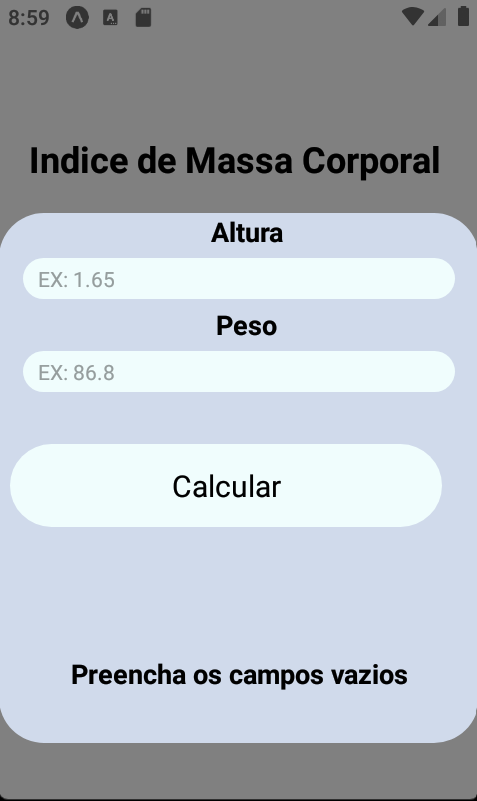
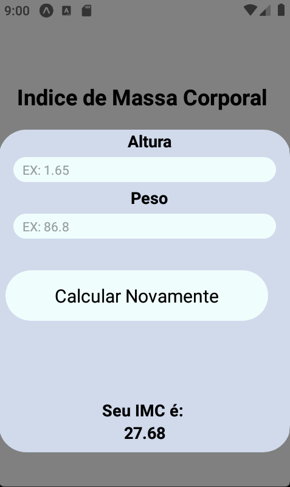

# Calculadora de Indice de Massa Corporal


<p align="center" width="100%">
    
    
    
</p>
> Este projeto tem como intuito colocar em prática conceitos sobre React Native. Se trata de uma aplicação que realiza o calculo do IMC (Indice de Massa Corporal) tendo como entradas a altura e o peso do usuário. 

### Ajustes e melhorias

O projeto ainda está em desenvolvimento e as próximas atualizações serão voltadas nas seguintes tarefas:

- [x] Criar Interface
- [x] Desenvolver a Lógica
- [x] Estilizar
- [ ] Desenvolver novas funcionalidades


## 💻 Pré-requisitos

Antes de começar, verifique se você atendeu aos seguintes requisitos:

* Você instalou a versão mais recente de `<JavaScript / npm / React / Expo>`
* Você tem uma máquina `<Windows / Linux / Mac>`. 


## ☕ Usando <IMC calculator>

Para usar <IMC calculator>, siga estas etapas:

```
<npm start>
```


